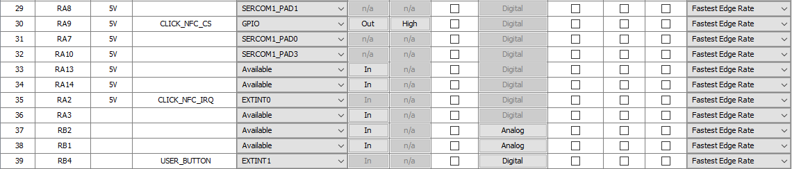

# PIC32CXBZ2_WBZ45x_NFC_STATIC_HANDOVER_BLE_PAIRING


> "IoT Made Easy!" 

Devices: **| PIC32CXBZ2 | WBZ45x |**<br>
Features: **| NFC | DEVICE INFORMATION SERVICES | BLE |**


## ⚠ Disclaimer

<p><span style="color:red"><b>
THE SOFTWARE ARE PROVIDED "AS IS" AND GIVE A PATH FOR SELF-SUPPORT AND SELF-MAINTENANCE. This repository contains example code intended to help accelerate client product development. </br>

For additional Microchip repos, see: <a href="https://github.com/Microchip-MPLAB-Harmony" target="_blank">https://github.com/Microchip-MPLAB-Harmony</a>

Checkout the <a href="https://microchipsupport.force.com/s/" target="_blank">Technical support portal</a> to access our knowledge base, community forums or submit support ticket requests.
</span></p></b>

## Contents

1. [Introduction](#step1)
1. [Bill of materials](#step2)
1. [Hardware Setup](#step3)
1. [Software Setup](#step4)
1. [Harmony MCC Configuration](#step5)
1. [Board Programming](#step6)
1. [Run the demo](#step7)

## 1. Introduction<a name="step1">

This application demonstrates the use of an NFC 4 Click which Emulates the BLE Pairing Credentials for Simple Secure BLE OOB Pairing.


## 2. Bill of materials<a name="step2">

| TOOLS | QUANTITY |
| :- | :- |
| [PIC32CX-BZ2 and WBZ451 Curiosity Development Board](https://www.microchip.com/en-us/development-tool/EV96B94A) | 1 |
| [NFC 4 Click](https://www.mikroe.com/nfc-4-click) | 1 |

## 3. Hardware Setup<a name="step3">

- Connect the NFC 4 Click Board to the Mikroe header of WBZ451 CURIOSITY DEVELOPMENT BOARD using the below table.

| WBZ451 | NFC 4 Click     | Description        |    | WBZ451 | NFC 4 Click     | Description |
| :-     | :-              | :-                 | :- | :-     | :-              | :-          |
| AN     | NC              | NC                 |    | PWM    | NC              | NC          |
| RST    | NC              | NC                 |    | INT    | 15(IRQ)         | INTERRUPT   |
| CS     | 3(CS)           | CHIP SELECT        |    | RX     | NC              | NC          |
| SCK    | 4(SCK)          | SPI CLOCK          |    | TX     | NC              | NC          |
| MISO   | 5(MISO)         | MASTER IN SLAVE OUT|    | SCL    | NC              | NC          |
| MOSI   | 6(MOSI)         | MASTER OUT SLAVE IN|    | SDA    | NC              | NC          |
| 3.3V   | 7(3.3V)         | POWER SUPPLY       |    | 5V     | NC              | NC          |
| GND    | 8 (GND)         | GROUND             |    | GND    | GND             | GROUND      |


## 4. Software Setup<a name="step4">

- [MPLAB X IDE ](https://www.microchip.com/en-us/tools-resources/develop/mplab-x-ide#tabs)

    - Version: 6.10
	- XC32 Compiler v4.10
	- MPLAB® Code Configurator v5.2.1
	- PIC32CX-BZ_DFP v1.1.218
	- MCC Harmony
	  - csp version: v3.17.0
	  - core version: v3.13.0
	  - CMSIS-FreeRTOS: v10.4.6
	  - wireless_pic32cxbz_wbz: v1.1.0
	  - dev_packs: v3.17.0
	  - wolfssl version: v4.7.0
	  - crypto version: v3.7.6
	  - wireless_ble: v1.0.0
	    

- Any Serial Terminal application like [TERA TERM](https://download.cnet.com/Tera-Term/3000-2094_4-75766675.html) terminal application

- [MPLAB X IPE v6.10](https://microchipdeveloper.com/ipe:installation)

- [LightBlue APP](https://play.google.com/store/apps/details?id=com.punchthrough.lightblueexplorer&pcampaignid=web_share)

## 5. Harmony MCC Configuration<a name="step5">

### Getting started with NFC 4 Click with WBZ451 CURIOSITY BOARD.

| Tip | New users of MPLAB Code Configurator are recommended to go through the [overview](https://onlinedocs.microchip.com/pr/GUID-1F7007B8-9A46-4D03-AEED-650357BA760D-en-US-6/index.html?GUID-AFAB9227-B10C-4FAE-9785-98474664B50A) |
| :- | :- |

**Step 1** - Connect the WBZ451 CURIOSITY BOARD to the device/system using a micro-USB cable.

**Step 2** - The project graph for this Demo application is shown below.


**Step 3** - In MCC harmony project graph, Add the BLE Stack from device resources under Libraries->Harmony->wireless->drivers->BLE and will prompt an Auto-activation for "Device_Support","PDS_SubSystem","NVM","Cryptographic","wolfcrypt Library" component, give yes to add the component and give yes to Auto-connect.

- In Device_Support add satisfiers by right click on the "⬦" in Device_Support->RTC to add the RTC component.


- Configure the BLE Stack as Shown below.

 


**Step 4** - In MCC harmony project graph, Add the SERCOM1 component under Libraries->Harmony->Peripherals->SERCOM->SERCOM1. select SERCOM1 and add "SPI" satisfiers by right click on the "⬦" near SPI to add the SPI component which will prompt an Auto-activation for "core"&"FreeRTOS" component, give yes to add the component and configure SERCOM1 and SPI as shown below.


**Step 5** - In MCC harmony project graph, select wolfCrypt Library and configure as mentioned below.


**Step 6** - In MCC harmony project graph, Add CONSOLE from Device Resources under Libraries->Harmony->System Services to add the "CONSOLE" component as shown below.


- To add satisfiers as shown above right click on the "⬦" in CONSOLE->UART and add the satisfier "SERCOM0" to add the component. Then select the SERCOM0 to configure as shown below.


**Step 7** - In MCC harmony project graph, select system and configure as mentioned below.


**Step 8** - In MCC harmony project graph, select Core and verify the mentioned below.


**Step 9** - In MCC harmony project graph, select FreeRTOS and configure as mentioned below.


**Step 10** - In MCC harmony project graph, Add EIC from Device Resources under Libraries->Harmony->Peripherals to add the "EIC" component and configure as shown below.


**Step 11** - In MCC harmony project graph, Add TIME from Device Resources under Libraries->Harmony->System Services to add the "TIME" component and configure as shown below.


**Step 12** - In MCC harmony project graph, Add the Device Information Service from device resources under Libraries->Harmony->wireless->drivers->BLE->Services to add the "Device Information Service" component and configure as shown below.


**Step 13** - In project graph, go to Plugins->Pin configurations->Pin settings and set the pin configuration as shown below.

- Use these PIN Names while configuring.

```
USER_LED
CLICK_NFC_CS
CLICK_NFC_IRQ
USER_BUTTON
```




**Step 14** - [Generate](https://onlinedocs.microchip.com/pr/GUID-A5330D3A-9F51-4A26-B71D-8503A493DF9C-en-US-1/index.html?GUID-9C28F407-4879-4174-9963-2CF34161398E) the code.

**Step 15** - From the unzipped folder copy the folder [nfc4_click](https://github.com/MicrochipTech/PIC32CXBZ2_WBZ45x_BLE_OOB_PAIRING_NFC/blob/main/firmware/src/nfc4_click) for adding the Header and Source files from RFAL and NDEF.

- In the project explorer, Right click on folder Header Files and select “Add Existing Items from Folders…” to add the header files and do the same for Source Files folder to add source files.


**Step 16** - Change the following Code as givien below.

- In your MPLAB Harmony v3 based application go to "firmware\src\app_user_edits.c", make sure the below code line is commented.

```
//#error User action required - manually edit files as described here.
```

- In your MPLAB application copy and paste the entire code from the mention file with link given below.

	- [app.h](https://github.com/MicrochipTech/PIC32CXBZ2_WBZ45x_BLE_OOB_PAIRING_NFC/blob/main/firmware/src/app.h).
	- [app.c](https://github.com/MicrochipTech/PIC32CXBZ2_WBZ45x_BLE_OOB_PAIRING_NFC/blob/main/firmware/src/app.c).
	- [app_ble.c](https://github.com/MicrochipTech/PIC32CXBZ2_WBZ45x_BLE_OOB_PAIRING_NFC/blob/main/firmware/src/app_ble/app_ble.c).
	- [app_ble_handler.c](https://github.com/MicrochipTech/PIC32CXBZ2_WBZ45x_BLE_OOB_PAIRING_NFC/blob/main/firmware/app_ble/app_ble_handler.c).
	- [tasks.c](https://github.com/MicrochipTech/PIC32CXBZ2_WBZ45x_BLE_OOB_PAIRING_NFC/blob/main/firmware/src/config/default/tasks.c).

- In your MPLAB application add the following code in the mention file with link given below.

	- [sys_tasks.h](https://github.com/MicrochipTech/PIC32CXBZ2_WBZ45x_BLE_OOB_PAIRING_NFC/blob/main/firmware/src/config/default/sys_tasks.h).

		- Add the following code
		
		```
		extern TaskHandle_t xISR_APP_Tasks;
		```
		
		

	- [sys_time.c](https://github.com/MicrochipTech/PIC32CXBZ2_WBZ45x_BLE_OOB_PAIRING_NFC/blob/main/firmware/src/config/default/system/time/sys_time.c).

		- Add the following code
		
		```
		bool SYS_TIME_TimerPeriodHasExpired(SYS_TIME_HANDLE handle)
		{
			SYS_TIME_TIMER_OBJ* tmr = NULL;
			bool status = false;

			if (SYS_TIME_ResourceLock() == false)
			{
				return status;
			}

			tmr = SYS_TIME_GetTimerObject(handle);

			if(tmr != NULL)
			{
				status = tmr->tmrElapsedFlag;
				/* After the application reads the status, clear it. */
				tmr->tmrElapsedFlag = false;
			}
			else
			{
				status=true;
			}

			(void) SYS_TIME_ResourceUnlock();
			return status;
		}
		```
		
		
		
**Step 17** - Clean and build the project. To run the project, select "Make and program device" button.
	
**Step 18** - The Application Serial logs can be viewed in [TERA TERM](https://download.cnet.com/Tera-Term/3000-2094_4-75766675.html) COM PORT.


	
## 6. Board Programming<a name="step6">

## Programming hex file:

### Program the precompiled hex file using MPLAB X IPE

- The Precompiled hex file is given in the hex folder.

Follow the steps provided in the link to [program the precompiled hex file](https://microchipdeveloper.com/ipe:programming-device) using MPLABX IPE to program the pre-compiled hex image. 


### Build and program the application using MPLAB X IDE

The application folder can be found by navigating to the following path: 

- "firmware/WBZ451_NFC_SH_BLE.X"

Follow the steps provided in the link to [Build and program the application](https://github.com/Microchip-MPLAB-Harmony/wireless_apps_pic32cxbz2_wbz45/tree/master/apps/ble/advanced_applications/ble_sensor#build-and-program-the-application-guid-3d55fb8a-5995-439d-bcd6-deae7e8e78ad-section).

## 7. Run the demo<a name="step7">

- After programming the board, the expected application behavior is shown in the below [video](https://github.com/MicrochipTech/PIC32CXBZ2_WBZ45x_BLE_OOB_PAIRING_NFC/blob/main/docs/BLE_OOB-min.gif).

